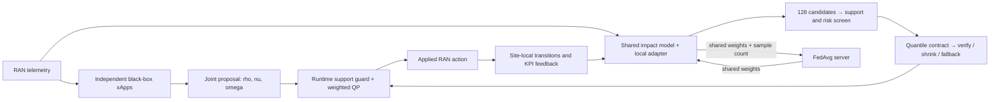
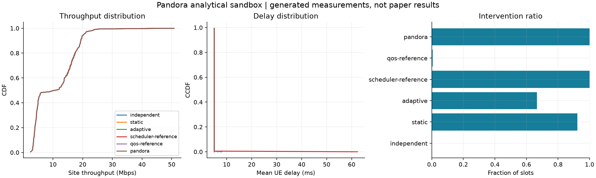

# Pandora

**Personalized Adaptive Network-Driven Open RAN Orchestration with Federated Contracts**

[](https://github.com/wsshinskku/Pandora/actions/workflows/ci.yml)


[한국어 설명](README.ko.md) · [Paper-to-code mapping](docs/paper-to-code.md) · [Reproducibility](docs/reproducibility.md) · [External RAN integration](docs/integration.md)

Pandora coordinates resource-allocation, traffic-steering, and QoS xApps without replacing their policies. A site learns the effects of joint actions, constructs a locally calibrated feasible region, and makes the smallest weighted correction to proposals outside that region. Sites share model updates while keeping their transitions, adapters, calibration residuals, and support statistics local.

This repository is an **independent reference implementation based on the supplied anonymous manuscript**. It contains executable learning, contract synthesis, projection, evaluation, and integration code. The included network backend is an **analytical sandbox**, not the paper's ns-O-RAN/ns-3–QuaDRiGa testbed. Generated measurements must not be presented as reproductions of Tables II–IV.

## Quick start

Requirements: Python 3.11 or newer and a CPU. CUDA is not required. Run commands from the repository root.

```bash
git clone https://github.com/wsshinskku/Pandora.git
cd Pandora
python -m venv .venv
```

Activate the environment:

```bash
# Linux / macOS
source .venv/bin/activate
```

```powershell
# Windows PowerShell
.\.venv\Scripts\Activate.ps1
```

Install and execute the complete small experiment:

```bash
python -m pip install --upgrade pip
python -m pip install -e ".[dev]"
python -m pytest -q
pandora run --config configs/smoke.yaml --output runs/first
```

The command collects separate training/calibration episodes, trains site models with FedAvg, calibrates risk, runs frozen-model test episodes, writes metrics and checkpoints, and renders a figure. Choose a **new output directory** for each run; the CLI refuses to mix or overwrite experiments.

For a CPU-only PyTorch installation, install PyTorch from its CPU index before installing this package:

```bash
python -m pip install torch --index-url https://download.pytorch.org/whl/cpu
python -m pip install -e ".[dev]"
```

## What is implemented

| Component | Implementation |
|---|---|
| Joint xApp actions | Resource shares `rho[U]`, per-UE steering simplex `nu[U,G]`, priorities `omega[U]` |
| Action-impact model | Shared `128 → 128 → 64` ReLU MLP, five-KPI regression head, binary risk head |
| Personalization | Site-private affine residual adapter on the 64-dimensional representation |
| Federated learning | Sample-weighted FedAvg of shared trunk/heads; adapters stay local |
| Support checking | Standardized nearest calibration sample; 95% leave-one-out distance quantile |
| Risk calibration | One-sided residual quantile and clipped upper-risk score |
| Candidates | Current proposal + 15 recent + 64 perturbations + 48 domain samples |
| Contract synthesis | Quantile box, sparse coupled inequalities, 64 verification actions, up to 3 shrinks |
| Runtime enforcement | Per-slot support guard and weighted OSQP projection, with a nonempty fallback |
| Evaluation | Held-out KPIs, tails, SLA exceedance, interventions, prediction/reliability metrics |
| Statistics | Seed-level bootstrap intervals and paired differences using shared seed IDs |
| Integration | Checkpoints, strict JSONL proposal/acknowledgement protocol, SINR CSV importer |

There are no fabricated manuscript measurements or placeholder implementations in the Pandora pipeline. The specific adapter structure, sparse coupling coefficients, traffic generator, SLA thresholds, and bootstrap exploration are documented engineering choices where the manuscript does not provide executable details.

## Architecture



For proposal `a_bar`, Pandora solves

```text
minimize    (a - a_bar)^T Lambda (a - a_bar)
subject to  lower <= a <= upper
            H a <= h
            sum_g nu[u,g] = 1   for each UE u
            sum_u rho[u] <= number_of_cells
```

The block weights are `(1.0, 1.5, 2.0)`. Larger weights preserve that xApp's proposal more strongly. Feasible proposals pass through unchanged within the solver tolerance. Executed decisions are not clipped or renormalized after projection because doing so could break coupled constraints.

## Experiments

### Compare reference methods

```bash
pandora run --config configs/smoke.yaml --output runs/comparison --methods independent static adaptive scheduler-reference qos-reference pandora
```

| CLI method | Meaning |
|---|---|
| `independent` | Execute the three xApps' concatenated proposals |
| `static` | Project into a fixed calibration-derived fallback contract |
| `adaptive` | Update a local 10%–90% box from compliant applied actions |
| `scheduler-reference` | Round-robin owner selection; suppress other blocks to neutral |
| `qos-reference` | Queue-based resource and priority correction heuristic |
| `pandora` | Full personalized, calibrated, coupled contract pipeline |

The two methods ending in `-reference` are transparent comparison heuristics. They are **not implementations of Sched-xApp or QACM**. FRL-Slicing and SafeSlice are not included: the supplied PDF does not specify enough of their training code and hyperparameters to claim faithful implementations. See [scope and omissions](docs/paper-to-code.md).

### Ablation study

```bash
pandora ablate --config configs/smoke.yaml --output runs/ablations
```

Runs `pandora`, `pandora-no-personalization`, `pandora-no-fl`, `pandora-no-calibration`, and `pandora-box-only`. Box-only removes learned coupling rows while retaining the hard domain, steering simplexes and aggregate resource budget.

### Aggressiveness and paired seeds

```bash
pandora sweep --config configs/smoke.yaml --output runs/aggressiveness --values 0.5 1.0 1.5 --seeds 0 1 2
pandora run --config configs/paper.yaml --output runs/paper-scale --seeds 0 1 2
```

`paper.yaml` records the manuscript's 4 sites, 20 UEs/site, 2 cells/site, 3600 slots, 30-slot contract periods, 600-slot FL periods, and 4/1/1 episode split. Its default seed list contains 20 seeds. **It scales the sandbox; it does not activate ns-3.** Runtime depends on hardware and how often synthesis reaches verification.

### Outputs

```text
runs/first/
├── config.json                  # Fully resolved configuration
├── manifest.json                # Backend, source hash, package versions, completion status
├── telemetry.csv                # Per-slot KPIs and contract decisions
├── metrics.json                 # Means, CIs, paired differences, prediction reliability
├── summary.csv                  # Flat table for analysis
├── performance.png              # Throughput CDF, delay CCDF, intervention ratio
├── training-<seed>-<method>.json # Losses, calibration margins, payload sizes
└── seed-<seed>/site-<site>/
    ├── train-<episode>.npz
    ├── calibration-<episode>.npz
    ├── <method>.pt               # Shared model and this site's private adapter
    ├── test-<method>.npz
    └── contracts-<method>.json
```

All ratios are stored in `[0,1]`, throughput in Mbps, delay in milliseconds, and queues in Mbit. Top-10% delay means the **lowest** delay samples; bottom-10% delay means the **highest**. Metrics are computed per site/episode, averaged within each seed, then bootstrapped over seeds. One-seed runs have `ci95: null`, since there is no seed-level uncertainty estimate.



This checked-in figure is generated by the included sandbox. In a small run, the empirical risk screen may reject every learned contract and use fallback for every slot. That is a measurable outcome, not evidence of a calibrated SLA guarantee. See [validation notes](docs/validation.md) for the exact checked run.

## Connect an external RAN process

```bash
python examples/external_loop.py --run runs/first --output runs/external-audit.jsonl
```

This exercises the real controller subprocess protocol with the sandbox standing in for the external plant. Replace the plant side with your ns-O-RAN telemetry and control hooks. `pandora control` emits projected actions and requires acknowledgement of the action actually applied before the next slot. Both are retained for correct action-impact learning.

[Integration instructions](docs/integration.md) cover the JSON schema, feature order, channel import, upstream dependencies, and the boundary between this repository and the platform-specific E2/scheduler implementation.

To train from external site-local episodes in the same NPZ schema:

```bash
pandora train --config configs/paper.yaml --data data --output runs/external-models --seed 0
```

See the [dataset layout and training protocol](docs/reproducibility.md#external-episode-training).

## Repository layout

```text
src/pandora/
  actions.py       # Action domain and reference coupling template
  contracts.py     # QP, fallback, feasibility, hit-and-run sampling
  calibration.py   # Support distances and empirical residual margin
  learning.py      # Shared MLP, local adapter, FedAvg
  synthesis.py     # Algorithm 1
  controller.py    # Slot-level orchestration
  simulator.py     # Explicitly labeled analytical sandbox
  xapps.py         # Reference black-box controllers
  baselines.py     # Runnable comparison heuristics
  experiment.py    # Train/calibrate/evaluate/export pipeline
  metrics.py       # Prediction, tails, paired bootstrap
  integration.py  # External-process control protocol
  traces.py        # Strict SINR CSV import
  plotting.py      # Figures from actual run data
  cli.py           # User-facing commands
configs/           # Small and manuscript-scale settings
examples/          # Executable external-process example
tests/             # Numerical oracle, data-isolation and integration tests
docs/              # Method mapping, assumptions, integration and validation
```

## Development

```bash
python -m ruff check .
python -m ruff format --check .
python -m pytest -q
python -m build
```

CI runs these checks and a small end-to-end experiment. A Docker image is also available from the included `Dockerfile`; it runs the Python sandbox, not ns-O-RAN.

```bash
docker build -t pandora .
docker run --rm -v "${PWD}/runs:/app/runs" pandora run --config configs/smoke.yaml --output runs/docker
```

## Scientific scope

The residual calibration and finite verification set provide an empirical screen. They do not establish a distribution-free chance-constraint guarantee, causal counterfactual identification, or safety under distribution shift. Fallback guarantees geometric feasibility of a predefined neutral action, not that arbitrary RAN conditions meet the SLA.

The manuscript's original ns-3 hooks, channel trajectories, raw results, exact sparse template, and published-baseline configurations are not supplied. The implementation choices and the manuscript's “Static” versus “Adaptive” table-label discrepancy are recorded in [paper-to-code.md](docs/paper-to-code.md).

## Citation and license

The source manuscript is titled *Pandora: Personalized Adaptive Network-Driven Open RAN Orchestration with Federated Contracts*, credited to Anonymous Authors in the supplied PDF. No DOI, publication year, or acceptance status is asserted here. Cite the authors' public bibliographic record once available. `CITATION.cff` identifies this software separately.

Original repository code is provided under the [MIT License](LICENSE). External tools such as ns-O-RAN and QuaDRiGa retain their own licenses and are not vendored here.
